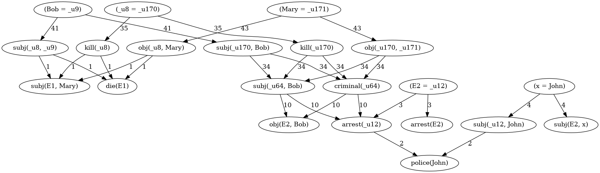

pydavid: A simple Python Interface of Open-David
==========================================================

Introduction
============
``pydavid`` is a simple Python interface of Open-David (version 1.73), an abductive reasoner written in C++.

Installation
============
``pydavid`` is a frontend of Open-David and does not include Open-David.
Please install `Open-David <https://github.com/aurtg/open-david>`__ ,
and then install ``pydavid`` by the following command.

.. code:: shell-session

    $ pip install pydavid

Usage
=====

The following is a sample code.
Before run, please set approapriate path to an executable file of Open-David
in your computer, download ``toy.dav`` in this repository, and
place it in your current working directly.

.. code:: python

    from pydavid    import OpenDavid
    from dhgraph    import DirectedHypergraph

    # PLEASE MODIFY PATH ACCORDING TO YOUR ENVIRONMENT.
    OpenDavid.set_david_path("/usr/local/bin/david")
    with open("toy.dav", mode="r") as f:
        data = f.read()
        OpenDavid.set_knowledge_base(data)

    observation_list = ["police(John)", "die(E1)", "subj(E1, Mary)",\
        "arrest(E2)", "subj(E2, x)", "obj(E2, Bob)"]
    required_atom_list = ["(x = John)"]
    OpenDavid.set_problem(observation_list, required_atom_list)
    json_str = OpenDavid.run() # Wait until it terminates if interpreter is used.

    # json is converted to a directed hypergraph.
    g = OpenDavid.build_proofgraph(json_str) 
    # "sample.png" will be generated in your cwd.
    g.render(filename="sample", format="png")

NOTE: ``toy.dav`` distributed in this repository was obtained from 
`Open-David <https://github.com/aurtg/open-david>`__ , but a problem field was
deleted, because ``pydavid`` separately sets knowledge base data and a problem data.

Please see `dhgraph <https://github.com/toda-lab/dhgraph>`__ for usage of
dhgraph.

Bugs/Requests/Discussions
=========================

Please report bugs and requests from `GitHub Issues <https://github.com/toda-lab/pydavid/issues>`__ , and 
ask questions from `GitHub Discussions <https://github.com/toda-lab/pydavid/discussions>`__ .

License
=======

Please see `LICENSE <https://github.com/toda-lab/pydavid/blob/main/LICENSE>`__ .
